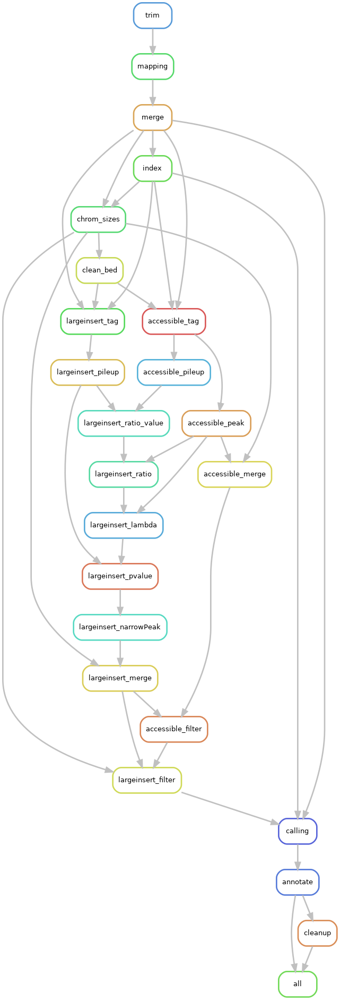

# circlehunter

circlehunter is a pipeline for identifying complex ecDNA using ATAC-Seq data.

## Pipeline Overview



## Dependencies

All dependencies can be installed using `mamba`

```bash
# install mamba in base environment
conda install -n base -c conda-forge mamba
# create new environment according to environment.yml
mamba env create -f environment.yml
# active the new environment
conda activate circlehunter
```

## Run the Pipeline

circlehunter use a `yaml` format config file to figure out all samples and their output, to run the analysis processes, a config file is needed. A config template is provided.

```bash
# make a directory for analysis
mkdir workspace
cd workspace
# copy and edit the config file
cp ../config-template.yaml config.yaml
```

modify the configuration file according to the template to fit your requirements, then run the pipeline by

```bash
snakemake --snakefile ../Snakefile -j 16 --configfile config.yaml
```

using `-j` option to specific maximum number of processes can be used by the pipeline. Check [snakemake documents](https://snakemake.readthedocs.io/) for more options.
